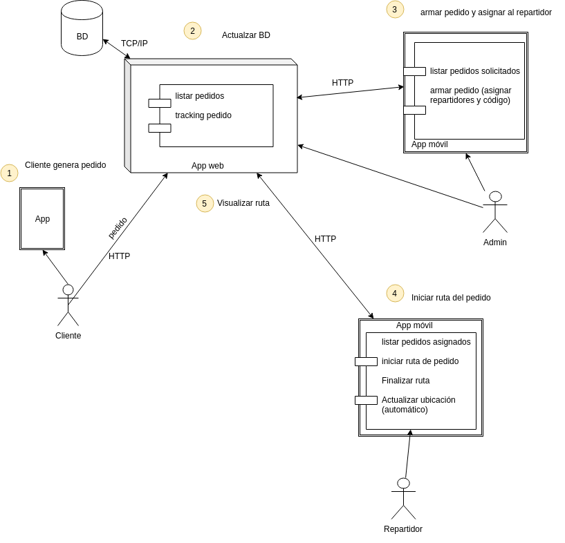
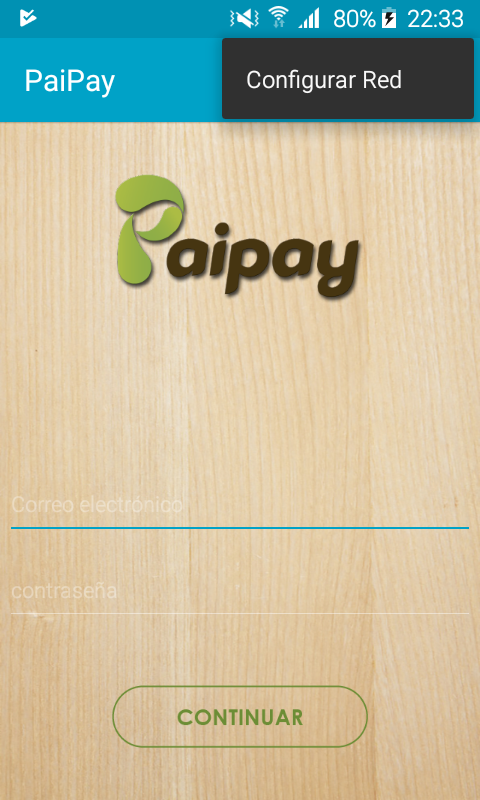
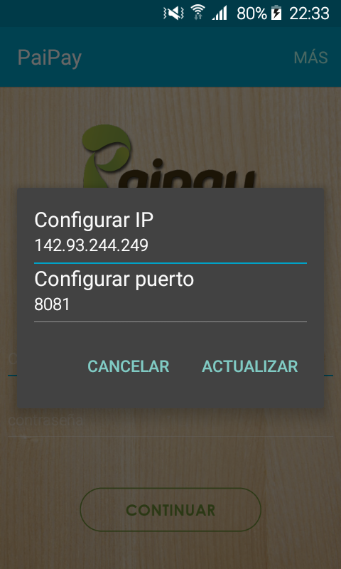
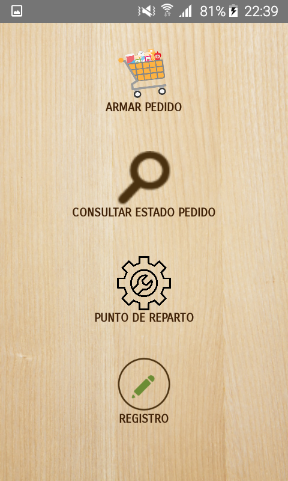

Proyecto comunitarias - App para "trabajadores" 
===============================================

Version 1.0 19/08/2019
----------------------

La herramienta desarrollada consiste en una aplicación móvil desarrollada para dispositivos android para el  proyecto: “Fomento para el desarrollo productivo y sostenible de la comuna de Paipayales” ubicada en el cantón Santa Lucía de la Provincia del Guayas de la Escuela Superior Politécnica del Litoral. 

Acontinuación se listan las funcionalidades desarrolladas para cada tipo de usuario 

1. Funcionalidades comunes para todos los usuarios: 
```
    Iniciar sesión 
    Configurar red: ip y puerto 
```
2. Usuarios de rol administrador: 
```
    Configurar centro de acopio 
    Listar pedidos asignados 
    Armar pedidos 
    Cancelar pedidos 
    Escanear código de barras 
    Listar productos que pertenecen a un pedido 
    Registrar usuarios 
    Consultar estado de los pedidos 
```
3. Usuarios de rol repartidor: 
```
    Listar pedidos asignados 
    Ver detalles de pedidos asignados 
    Iniciar recorrido 
    Cancelar pedido 
    Escanear código de barras 
```
 
# Esquema de funcionamiento



* Capturas de la aplicación
---------------------------
1. Configurar red 
<br>


<br>
2. Usuario administrador. Menú

<br>
3. Resto de capturas [Capturas](capturas/)

REFERENCIAS :
    [ Uso de lector RFID - TRIMBLE T41 ](https://github.com/CVR-FIEC-ESPOL/cnel-espol)